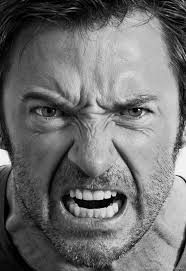

# Facial expression recognition

All models are trained on the fer2013 dataset.  
You can download a dataset [here](https://www.kaggle.com/astraszab/facial-expression-dataset-image-folders-fer2013).  
Alternatively, you can download data in CSV format [here](https://www.kaggle.com/deadskull7/fer2013) and run unpack_data.py script.


I used three different architectures for this task. CustomNet is a simple CNN with 3 convolution layers. Another two architectures are resnet18 and vgg16. It appears that resnet and vgg get overfitted pretty fast, but still have relatively big accuracy on validation if training is stopped early. CustomNet is too simple and therefore underfitted.

Test set accuracy:
- Custom net: 57%
- VGG16: 66%
- ResNet18: 68%

You can see more details in corresponding notebooks.

To evaluate models on your own photos run:
```sh
python predict.py -i photo_name.jpg -m model_name
```
Available model names are custom, vgg16, and resnet18. 
I provide weights for CustomModel so you can try it out of the box. If you want to try other models, first load the dataset and run notebooks to train these models.

#### Examples of usage:




